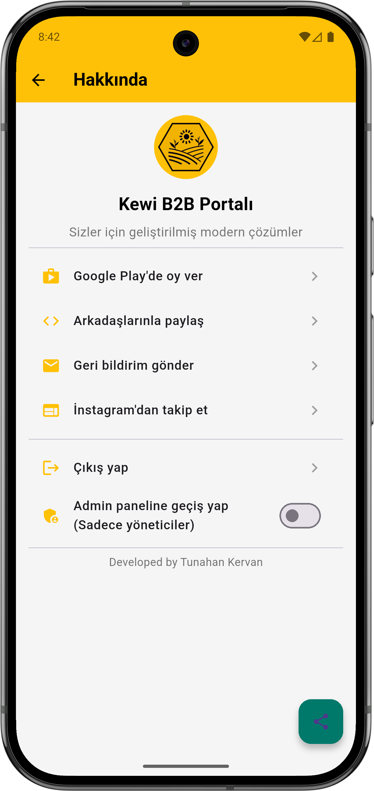
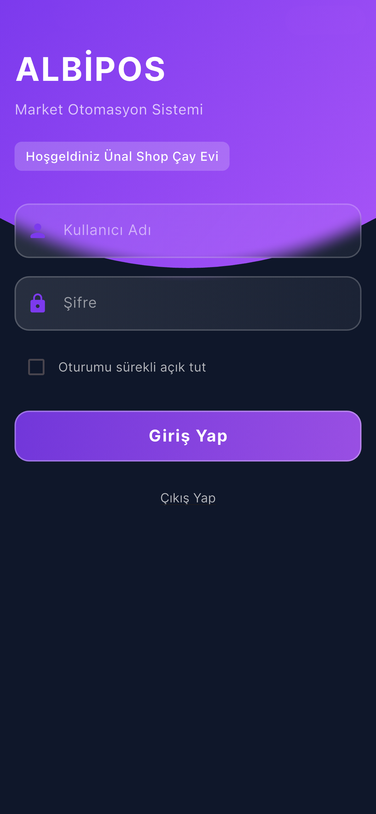
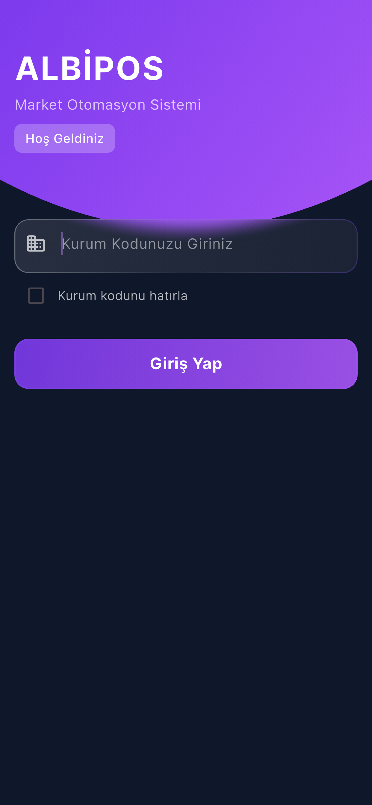
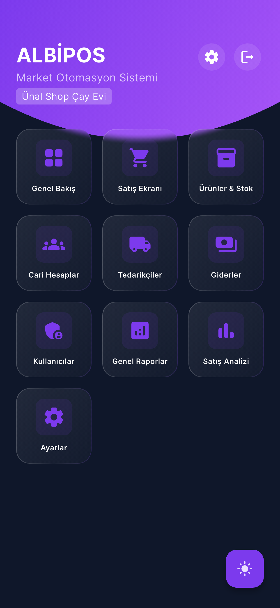
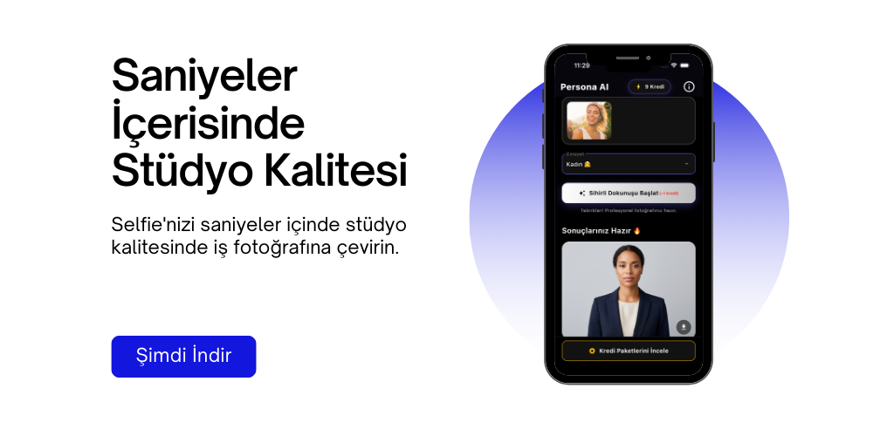
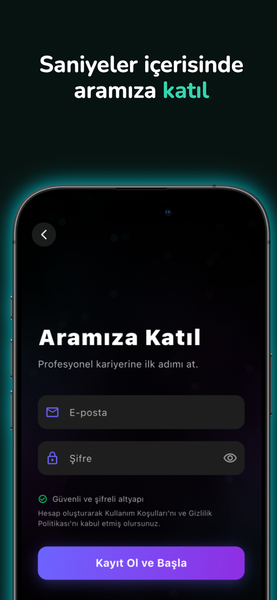
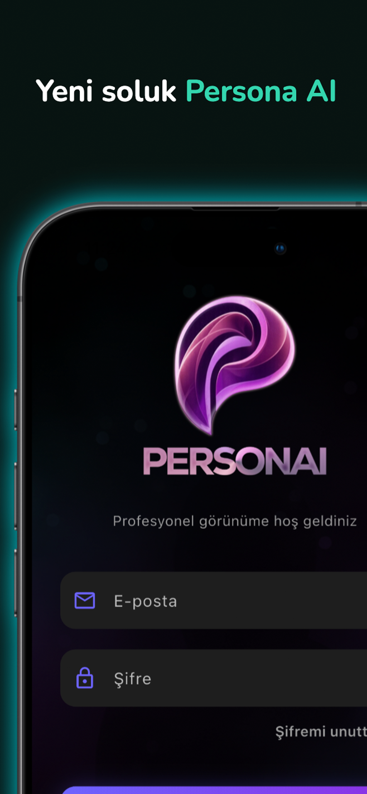
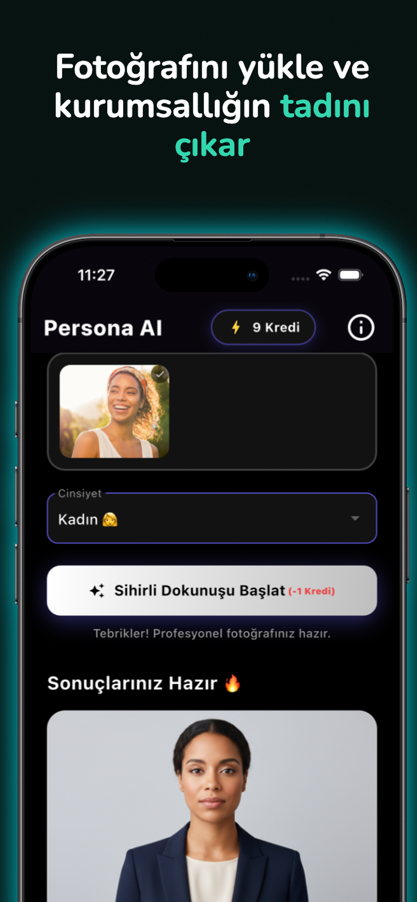
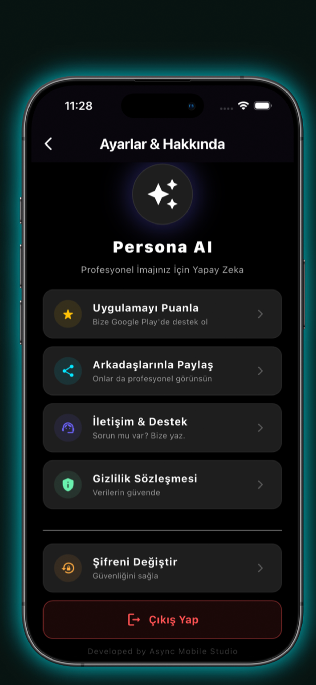

# PORTFOLİO
# 📱 Yempati Uygulaması

Hayvanlara destek olmayı amaçlayan reklam izleme tabanlı bir mobil uygulama.  
Aynı zamanda Kayıp evcil hayvan bildirimi yapılabiliyor.

---

## 🚀 Özellikler
- Reklam izleme ile puan kazanma
- Lig sıralaması
- kayıp evcil hayvan bildirimi
- Firebase entegrasyonu
- Görsel yükleme (İmagekit.io)
- Firebase functions(lig sıralaması için)
- Anlık bildirim gönderme

---

## 🛠 Kullanılan bağımlılıklar
-	google_mobile_ads
-	firebase_core
-	cloud_firestore
-	firebase_messaging
-	flutter_local_notifications
-	firebase_auth
-	share_plus
-	flutter_launcher_icons
-	firebase_crashlytics
-	firebase_analytics
-	awesome_snackbar_content
-	connectivity_plus
-	image_picker
-	cloud_functions
  

---

## 📸 Ekran Görüntüleri
     

-------
-------

# 📱 Kewi b2b Uygulaması

Kewi bayi portalı, webview tabanlı bir mobil uygulama.

---

## 🚀 Özellikler
- Webview
- runJavaScript ile kullanıcı giriş bilgileriyle portala otomatik giriş yapılıyor.

---

## 🛠 Kullanılan bağımlılıklar
-	google_mobile_ads
- webview_flutter
- share_plus
- url_launcher
- convex_bottom_bar
- shared_preferences

---

## 📸 Ekran Görüntüleri
     

-------
-------

# 📱 Future Test uygulaması

Öğrencilerin giriş yapıp testleri görüntüleyebildiği sınav süresi boyunca soruları çözebildiği bir mobil uygulama.

---

## 🚀 Özellikler
- API
- Pdf view
- Audio Play

---

## 🛠 Kullanılan bağımlılıklar
- flutter_pdfview
- connectivity_plus
- path_provider
- shared_preferences
- just_audio
- http

---

## 📸 Ekran Görüntüleri
    

-------
-------

# 📱 Tekno karne uygulaması

E-Okul benzeri özel okul için bir mobil uygulama 

---

## 🚀 Özellikler
- Swagger API

---

## 🛠 Kullanılan bağımlılıklar
- shared_preferences
- http

---

## 📸 Ekran Görüntüleri
   

-------
-------

# 📱 AlbiPos uygulaması

ALBİPOS, market ve işletmeler için geliştirilmiş modern bir otomasyon uygulamasıdır.
Uygulama, API üzerinden güvenli giriş işlemlerini gerçekleştirir ve kullanıcıyı yetkili olduğu alanlara yönlendirir.

Giriş sonrasında tanımlı domain adresine yönlendirme yapılır. Kullanıcı adı ve şifre bilgileri, uygulama tarafından arka planda otomatik olarak doldurularak hızlı ve kesintisiz bir deneyim sunulur. Bu işlem WebView altyapısı kullanılarak gerçekleştirilir.

Uygulama içerisinde, web tabanlı sistemde yer alan menüler mobil uyumlu hale getirilmiştir. Sidebar menüsü uygulama içine entegre edilerek kullanıcıların satış, stok, raporlama ve diğer modüller arasında kolayca geçiş yapması sağlanır.

ALBİPOS, işletmelerin mevcut web otomasyon altyapısını mobil ortamda daha pratik ve erişilebilir hale getirmeyi amaçlar.

---

## 🚀 Özellikler
- API
- Javascript

---

## 🛠 Kullanılan bağımlılıklar
- connectivity_plus
- path_provider
- shared_preferences
- http

---

## 📸 Ekran Görüntüleri
    

-------
-------

# 📱 personaAI – Kurumsal Profil Fotoğrafı Dönüştürücü

personaAI, kullanıcıların yüklediği selfie fotoğraflarını yapay zeka destekli olarak profesyonel ve kurumsal profil fotoğraflarına dönüştüren bir uygulamadır.

Uygulama, kullanıcı tarafından yüklenen fotoğrafı analiz eder ve gelişmiş yapay zeka modelleri sayesinde yüz hatlarını koruyarak daha net, dengeli ve kurumsal görünümlü bir fotoğraf üretir. Bu sayede LinkedIn, CV, kurumsal web siteleri ve iş profilleri için uygun görseller elde edilir.

personaAI, güçlü yapay zeka servisleri ve görüntü işleme altyapısı kullanarak arka planda otomatik dönüşüm işlemleri gerçekleştirir. Süreç boyunca kullanıcıdan ek bir düzenleme gerektirmez; tek bir fotoğraf ile hızlı ve etkili sonuçlar sunar.

Üretilen görseller, profesyonel kullanım odaklı olacak şekilde ışık, arka plan ve genel görünüm açısından optimize edilir. Kullanıcı deneyimi sade ve hızlı tutulur.

personaAI, kişisel fotoğrafları profesyonel bir kimliğe dönüştürmeyi amaçlayan modern bir yapay zeka uygulamasıdır.

---

## 🚀 Özellikler
- Replicate API
- Google Nano banana pro
- image picker ile görsel yükleme
- in App Purchase (Uygulama içi satın alma)
- Anlık bildirim gönderme

---

## 🛠 Kullanılan bağımlılıklar
 - http
 - image_picker
 - in_app_purchase
 - cloud_firestore
 - firebase_messaging
 - firebase_auth
 - firebase_crashlytics
 - google_mobile_ads
 - sign_in_with_apple
 - crypto
 - google_sign_in
 - share_plus
 - url_launcher
 - flutter_native_splash

---

## 📸 Ekran Görüntüleri
  

 
 

-------
-------
