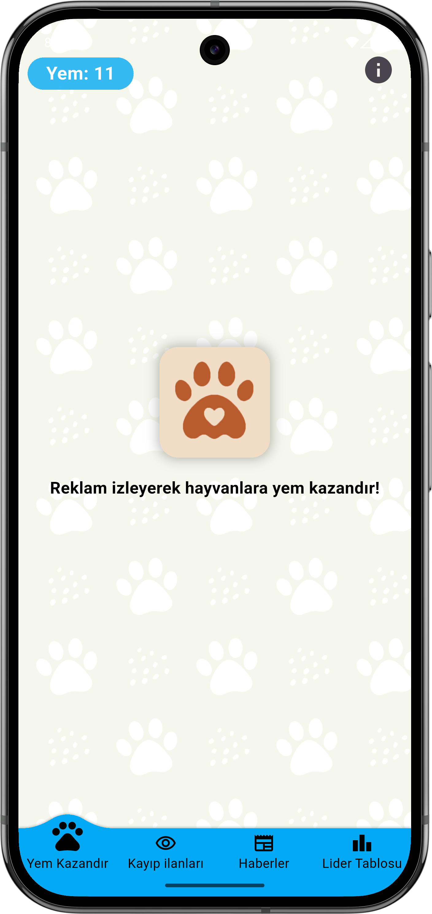

# portfolio
# 📱 Yempati Uygulaması

Hayvanlara destek olmayı amaçlayan reklam izleme tabanlı bir mobil uygulama.  
Aynı zamanda Kayıp evcil hayvan bildirimi yapılabiliyor.

---

## 🚀 Özellikler
- Reklam izleme ile puan kazanma
- Lig sıralaması
- kayıp evcil hayvan bildirimi
- Firebase entegrasyonu
- Görsel yükleme (İmagekit.io)

---

## 🛠 Kullanılan bağımlılıklar
-	google_mobile_ads
-	firebase_core
-	cloud_firestore
-	firebase_messaging
-	flutter_local_notifications
-	firebase_auth
-	share_plus
-	flutter_launcher_icons
-	firebase_crashlytics
-	firebase_analytics
-	awesome_snackbar_content
-	connectivity_plus
-	image_picker
-	cloud_functions
  

---

## 📸 Ekran Görüntüleri
 

---
