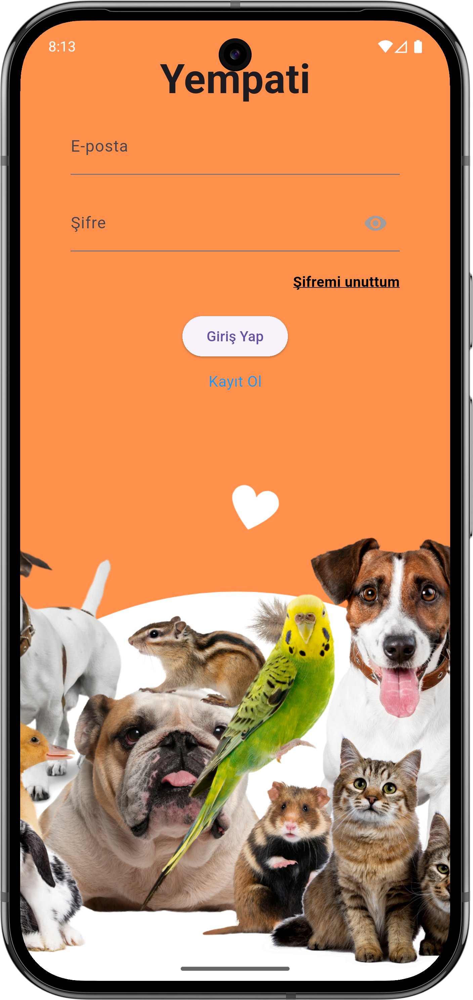
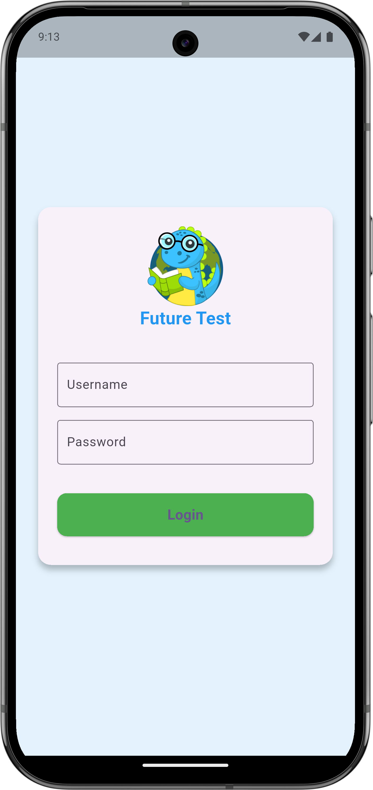
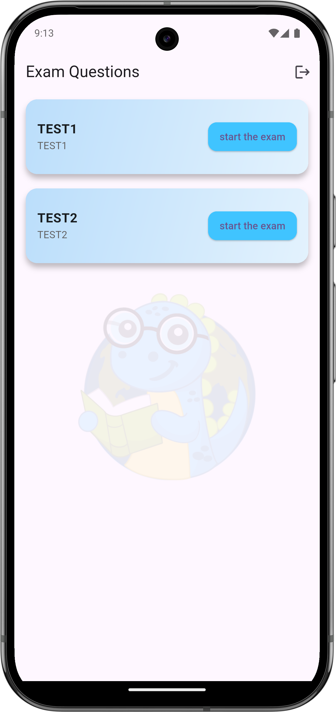
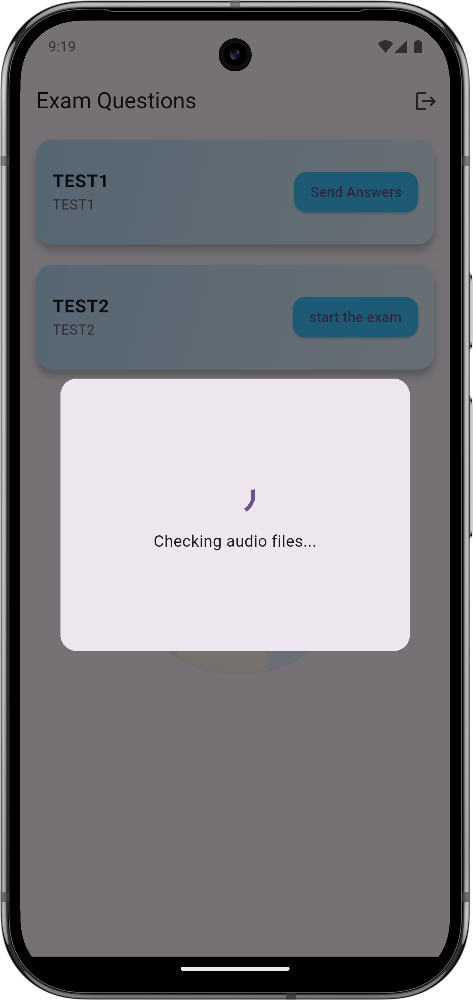
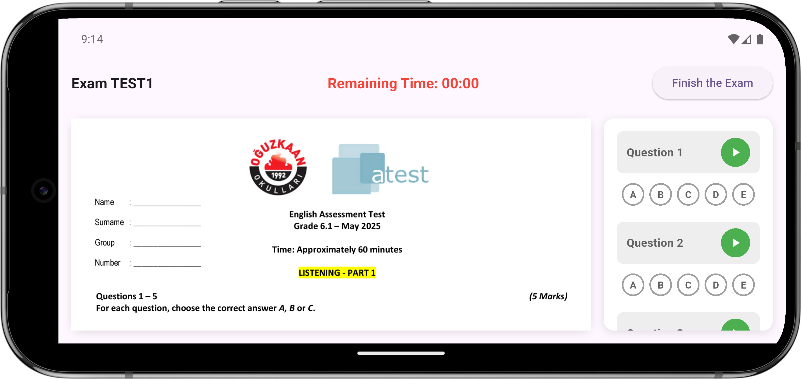
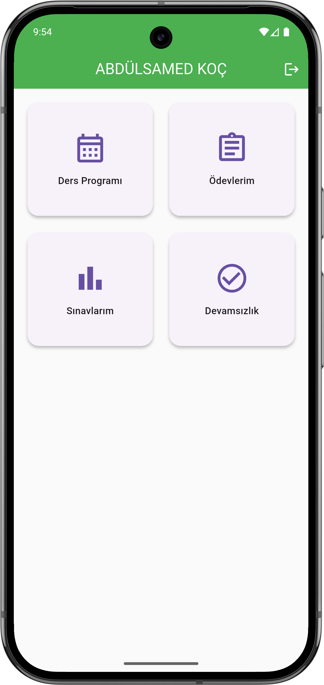
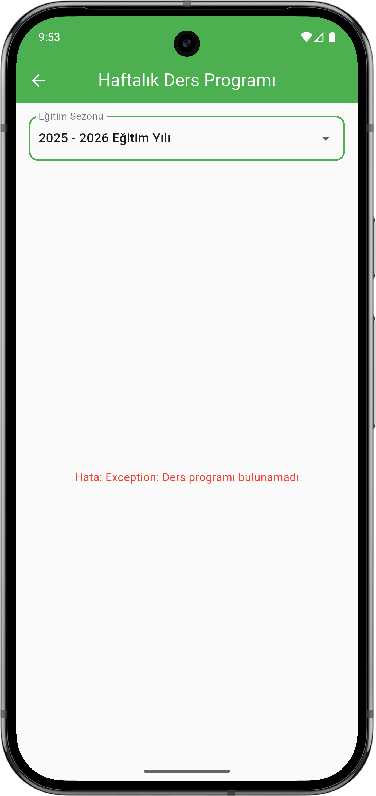

# portfolio
# 📱 Yempati Uygulaması

Hayvanlara destek olmayı amaçlayan reklam izleme tabanlı bir mobil uygulama.  
Aynı zamanda Kayıp evcil hayvan bildirimi yapılabiliyor.

---

## 🚀 Özellikler
- Reklam izleme ile puan kazanma
- Lig sıralaması
- kayıp evcil hayvan bildirimi
- Firebase entegrasyonu
- Görsel yükleme (İmagekit.io)
- Firebase functions(lig sıralaması için)
- Anlık bildirim gönderme

---

## 🛠 Kullanılan bağımlılıklar
-	google_mobile_ads
-	firebase_core
-	cloud_firestore
-	firebase_messaging
-	flutter_local_notifications
-	firebase_auth
-	share_plus
-	flutter_launcher_icons
-	firebase_crashlytics
-	firebase_analytics
-	awesome_snackbar_content
-	connectivity_plus
-	image_picker
-	cloud_functions
  

---

## 📸 Ekran Görüntüleri
     

-------
-------

# 📱 Kewi b2b Uygulaması

Kewi bayi portalı, webview tabanlı bir mobil uygulama.

---

## 🚀 Özellikler
- Webview
- runJavaScript ile kullanıcı giriş bilgileriyle portala otomatik giriş yapılıyor.

---

## 🛠 Kullanılan bağımlılıklar
-	google_mobile_ads
- webview_flutter
- share_plus
- url_launcher
- convex_bottom_bar
- shared_preferences

---

## 📸 Ekran Görüntüleri
     

-------
-------

# 📱 Future Test uygulaması

Öğrencilerin giriş yapıp testleri görüntüleyebildiği sınav süresi boyunca soruları çözebildiği bir mobil uygulama.

---

## 🚀 Özellikler
- API
- Pdf view
- Audio Play

---

## 🛠 Kullanılan bağımlılıklar
- flutter_pdfview
- connectivity_plus
- path_provider
- shared_preferences
- just_audio
- http

---

## 📸 Ekran Görüntüleri
    

-------
-------

# 📱 Tekno karne uygulaması

E-Okul benzeri bir mobil uygulama 

---

## 🚀 Özellikler
- API

---

## 🛠 Kullanılan bağımlılıklar
- shared_preferences
- http

---

## 📸 Ekran Görüntüleri
   
